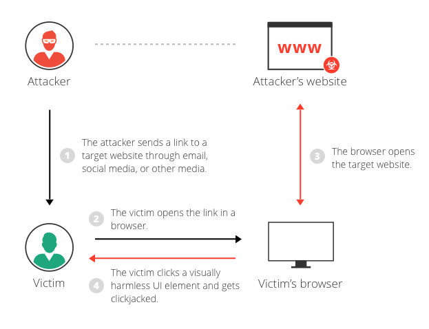

<!--
 * @Author: kok-s0s
 * @Date: 2021-05-06 15:53:24
 * @LastEditTime: 2021-05-09 14:57:51
 * @Description: HTML和潜在漏洞
-->

[HTML](https://developer.mozilla.org/zh-CN/docs/Web/HTML) HyperText Markup Language

[DOM](https://developer.mozilla.org/zh-CN/docs/Web/API/Document_Object_Model/Introduction) Document Object Model 文档对象模型

HTML 是一种标记型语言。所见即所得！

**HTML 潜在漏洞**

纯 HTML 基本没有漏洞

[Iframe](https://developer.mozilla.org/zh-CN/docs/Web/HTML/Element/iframe) 内联框架元素

[clickjack](https://www.imperva.com/learn/application-security/clickjacking/) 点击劫持

