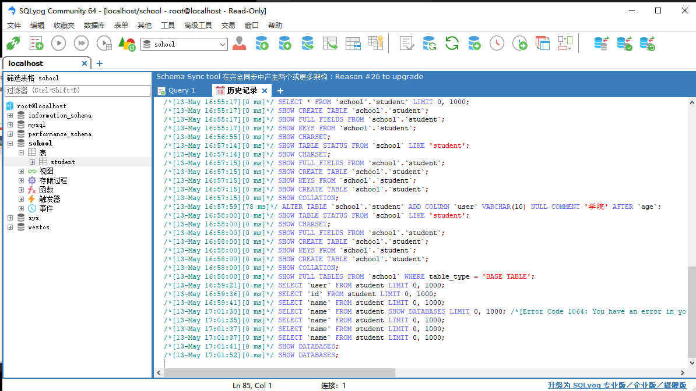

## 初识 MySQL

### 数据库 导论

JavaEE：企业级开发 Web 需要

前端（页面：展示，数据！）

后台（连接点：连接数据库 JDBC，链接前端（控制视图跳转，和给前端传递数据））

数据库（存数据，Txt，Excel，Word，。。。）

数据库（DB，DateBase）

概念：数据仓库，软件，安装在操作系统（Windows，Linux，mac..）之上！SQL，可以存储大量的数据。500 万！

作用：存储数据，管理数据

### 数据库分类

关系型数据库：（SQL）

- MySQL / Oracle / Sql Server / DB2 / SQLlite
- 通过表和表之间，行和列之间的关系进行数据的存储，eg：学员信息表，考勤表

非关系型数据库：（NoSQL）Not Only SQL

- Redis / MongDB
- 非关系型数据库，对象存储，通过对象自身的属性来决定

<font color=red>DBMS(数据库管理系统)</font>

- 数据库的管理软件，科学有效的管理我们的数据。维护和获取数据。
- MySQL，数据库管理系统！

### <font color=orange>MySQL 安装</font>

不推荐 exe 安装，因为后续卸载可能卸不干净

使用压缩包安装

[官网](https://www.mysql.com/)

安装步骤：

1. 下载安装包解压到你想放的目录下

2. 添加环境变量里 bin 文件

3. 因为是用压缩包，需要编写配置文件 ini

   ```ini
   [mysqld]
   # 目录路劲为自己解压缩的位置
   basedir=Y:\environment\mysql-5.7.33\
   datadir=Y:\environment\mysql-5.7.33\data\
   port=3306
   skip-grant-tables
   ```

4. 在管理员模式下运行 cmd 使用命令安装 MySQL 服务以及初始化数据库文件

   ```bash
   # windows操作
   # 要切换到bin目录下
   $ mysqld -install
   Service successfully installed.

   # 初始化数据文件 生成data文件夹
   $ mysqld --initialize-insecure --user=mysql
   ```

5. 启动 MySQL，进去修改密码

   ```bash
   $ net start mysql
   ```

6. 进去 MySQL 通过命令行修改密码（sql 语句后面需要加分号！）

   ```bash
   $ update mysql.user set authentication_string=password('123456') where user='root' and Host = 'localhost';

   # 之后启动MySQL需要输入密码  -p后面不能加空格！
   $ mysql -u root -p
   ```

7. 注释掉`ini`文件里的跳过密码命令

> sc delete mysql # 清空服务

### 安装 SQLlog

pass

### 连接数据库

```bash
$ mysql -uroot -p123456 # 连接数据库

$ update mysql.user set authentication_string=password('123456') where user='root' and Host = 'localhost'; # 修改用户密码

$ flush privileges;     # 刷新权限
```

```mysql
-- mysql的语句末尾都需要添加;号来结束

show databases;  -- 查看所有的数据库

mysql > use school  --切换数据库  use 数据库名
Database changed;

show tables;   --查看数据库中所有的表
describe student;    --显示数据库中所有的表的信息

create database westos;   --创建一个数据库

exit;  --退出连接

-- 单行注释（SQL本来的注释）

/*    (sql的多行注释)
kok-s0s
散文不倦
*/
```

数据库 XXX 语言 CRUD 增删改查！

DDL 定义 define

DML 操作 manage

DQL 查询 query

DCL 控制 control

## 操作数据库

操作数据库 > 操作数据库中的表 > 操作数据库中表的数据

==MySQL 关键字不区分大小写==

[] 括号为可选项

1. 创建数据库

```sql
CREATE DATABASE [IF NOT EXISTS] westos

```

2. 删除数据库

```sql
DROP DATABASE IF EXISTS test001
```

3. 使用数据库

```sql
-- tab键的上面，如果你的表明或者字段名是一个特殊字符，就需要带有``符号来包括它。
SELECT `name` FROM student
```

4. 查看数据库

```sql
SHOW DATABASES -- 查看所有的数据库
```

指令对比 SQLyog 的操作学习 查看 SQLyog1 的可视化历史记录查看相关 SQL 指令实现



### 列的数据类型

> 数值

- tinyint 十分小的数据 1 个字节
- smallint 较小的数据 2 个字节
- mediumint 中等大小的数据 3 个字节
- int 标准的整数 4 个字节
- bigint 较大的数据 8 个字节
- float 浮点数 4 个字节
- double 浮点数 8 个字节 （精度问题！）
- decimal 字符串形式的浮点数 金融计算的时候，一般是使用 decimal

> 字符串

- char 字符串固定大小的 0~255
- varchar 可变字符串 0~65535 常用的 String
- tinytext 微型文本 2^8-1
- text 文本串 2^16-1 保存大文本

> 时间日期

- date YYYY-MM-DD,日期格式
- time HH: mm: ss 时间格式
- datetime YYYY-MM-DD HH: mm: ss 最常用的时间格式
- timestamp 时间戳 1970.1.1 到现在的毫秒数！ 较为常用
- year 年份表示

> null

- 没有值，未知
- ==注意，不能使用 NULL 进行运算，结果为 NULL==

### 数据库的字段属性（==Turing Point==）

Unsigned

- 无符号的整数
- 声明了该列不能声明为负数

Zerofill？

- 0 填充的
- 不足的位数，使用 0 来填充，eg：int(3), 5 005

自增？

- 通常理解为自增，自动在上一条记录的基础上 + 1 （默认）
- 通常用来设计唯一的主键 ~index，必须是整数类型
- 可以自定义设计主键自增的起步值和步长

非空？ NULL not null

- 假设设置为 not null，如果不给它赋值，就会报错！
- NULL，如果不填写值，默认就是 null！

默认

- 设置默认的值！
- eg：默认值为男

---

==Extend==

```sql
/* 每一个表都必须存在以下五个字段
id 主键
`version` 乐观锁
id_delete 伪删除
gmt_create 创建时间
gmt_update 修改时间
*/
```

### 创建数据库表

==task==

1. 创建一个新的数据库 class
2. 创建一个记录表 使用 SQL 创建
3. 表的列：学号 int 登录密码 varchar 姓名 varchar Email 等等

==Solution==

```sql
CREATE TABLE IF NOT EXISTS `student` (
	`id` INT(4) NOT NULL AUTO_INCREMENT COMMENT '学号',
	`name` VARCHAR(20) NOT NULL DEFAULT '匿名' COMMENT '姓名',
	`pwd` VARCHAR(20)NOT NULL DEFAULT '123456' COMMENT '密码',
	`sex` VARCHAR(2) NOT NULL DEFAULT '女' COMMENT '性别',
	`birthday` DATETIME DEFAULT NULL COMMENT '出生日期',
	`address` VARCHAR(100) DEFAULT NULL COMMENT '家庭住址',
	`email` VARCHAR(50) DEFAULT NULL COMMENT '邮箱',
	PRIMARY KEY (`id`)
)ENGINE=INNODB DEFAULT CHARSET=utf8
```

格式

```sql
CREATE TABLE [IF NOT EXISTS] `表名` (
   '字段名' 列类型 [属性] [索引] [注释],
   '字段名' 列类型 [属性] [索引] [注释],
   ......
   '字段名' 列类型 [属性] [索引] [注释]
)[表类型][字符集设置][注释]
```

**逆向操作得到原始 sql 语句**

```sql
SHOW CREATE DATABASE class --查看如何创建数据库
CREATE DATABASE `class` /*!40100 DEFAULT CHARACTER SET latin1 */

SHOW CREATE TABLE student --查看如何创建表
CREATE TABLE `student` (
  `id` int(4) NOT NULL AUTO_INCREMENT COMMENT '学号',
  `name` varchar(20) NOT NULL DEFAULT '匿名' COMMENT '姓名',
  `pwd` varchar(20) NOT NULL DEFAULT '123456' COMMENT '密码',
  `sex` varchar(2) NOT NULL DEFAULT '女' COMMENT '性别',
  `birthday` datetime DEFAULT NULL COMMENT '出生日期',
  `address` varchar(100) DEFAULT NULL COMMENT '家庭住址',
  `email` varchar(50) DEFAULT NULL COMMENT '邮箱',
  PRIMARY KEY (`id`)
) ENGINE=InnoDB DEFAULT CHARSET=utf8

DESC student --显示表的结构
```

```sql
--关于数据库引擎
/*
INNDOB 默认使用
MYISAM 早些年使用的
*/
```

|              | MYISAM | INNDOB                   |
| ------------ | ------ | ------------------------ |
| 事务支持     | 不支持 | 支持                     |
| 数据行锁定   | 不支持 | 支持                     |
| 外键约束     | 不支持 | 支持                     |
| 全文索引     | 支持   | 不支持                   |
| 表空间的大小 | 较小   | 较大，约为 MYISAM 的两倍 |

常规使用操作：

- MYISAM 节约空间，速度较快
- INNODB 安全性高，事务处理，多表多用户操作

> 在物理空间存在的位置

所有的数据库文件都存在`data`目录下

本质还是文件的存储！

MySQL 数据库引擎在物理文件上的区别

- INNODB 在数据库表中只有一个`*frm`文件，以及上级目录下的`ibdata1`文件
- MYISAM 对应文件
  - `*.frm` - 表结构的定义文件
  - `*MYD` - 数据文件（data）
  - `*.MYI` - 索引文件（index）

> 设置数据库表的字符集编码

```sql
CHARSET=utf8
```

不设置的话，会被设置为 MySQL 的默认字符集编码`Latin 1`（不支持中文！）

在`my.ini`中配置默认编码

```sql
character-set-server=utf8
```

### 修改删除表

> 修改

```sql
-- 修改表名 ：ALTER TABLE 旧表名 RENAME AS 新表名
ALTER TABLE teacher RENAME AS teacher1
-- 增加表的字段 ：ALTER TABLE 表名 ADD 字段名 列属性
ALTER TABLE teacher1 ADD age INT(11)

-- 修改表的字段 （重命名，修改约束!）
-- ALTER TABLE 表名 MODIFY 字段名 列属性[]
ALTER TABLE teacher1 MODIFY age VARCHAR(11) -- 修改约束
--  ALTER TABLE 表名 CHANGE 旧名字 新名字 列属性[]
ALTER TABLE teacher1 CHANGE age age1 INT(i) -- 字段重命名

-- 删除表的字段 ：ALTER TABLE 表名 DROP 字段名
ALTER TABLE teacher1 DROP age1
```

> 删除

```sql
-- 删除表（如果表存在再删除）
DROP TABLE IF EXISTS teacher1
```

**所有的创建和删除操作尽量加上判断，以免报错！**

Tips：

- ``字段名，使用这个包裹！
- 注释 -- or `/* */`
- sql 关键字大小写不敏感，建议使用小写

## MySQL 数据管理

### 外键

约束 constraint


### DML 语言 （Important）

### 
