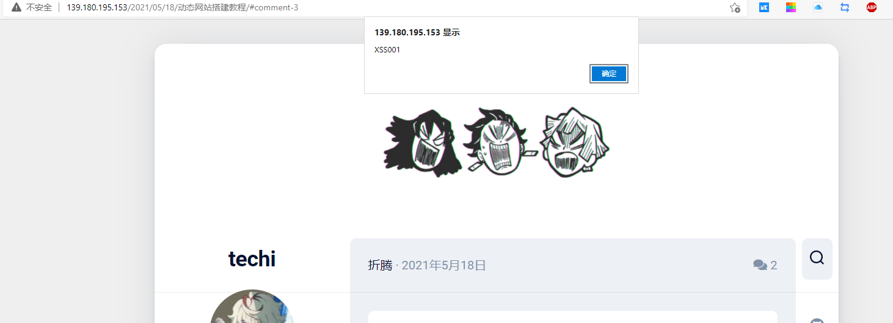
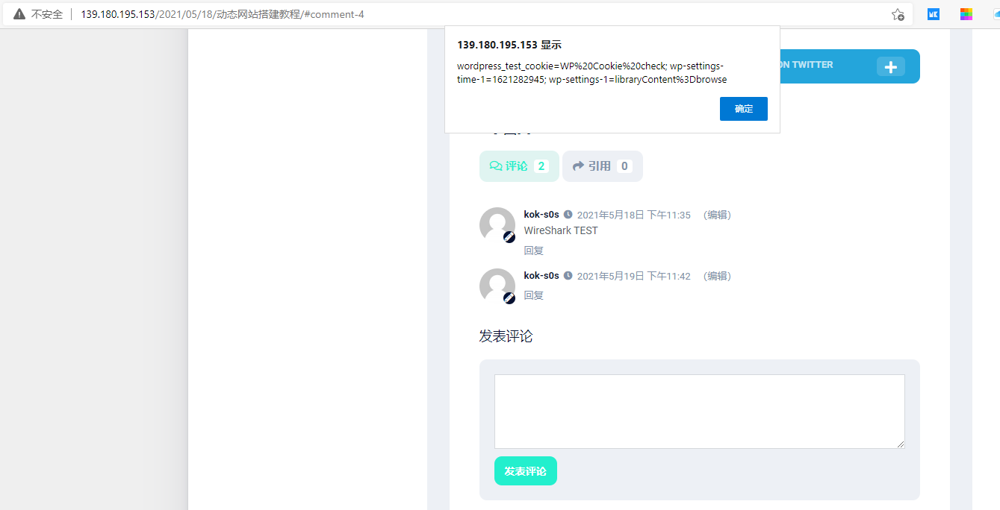

<!--
 * @Author: kok-s0s
 * @Date: 2021-05-19 23:07:33
 * @LastEditTime: 2021-05-20 15:52:18
 * @Description: XSS 跨站脚本攻击
-->

XSS (Cross Site Script) 跨站脚本攻击
网页内嵌入 HTML，CSS，JS 代码

**分类**

- 反射型 -- 前端->后端->前端
  
  
- 存储型 -- 前端->后端->数据库->前端
- DOM 型 -- 前端

短链接生成

- 悟空短链接

tips

- 谨慎使用别的 js 代码（即 link 别人的 js 代码）
- 过滤很重要（把不需要的字符串过滤掉）
- 正则过滤
- 逻辑 yara

**XSS 绕过**

- 分析过滤了的字符串
- 用相同功能的去替换

**学习**

- 常总结（绕过方式）
- 熟悉 JS 和闭包标签
