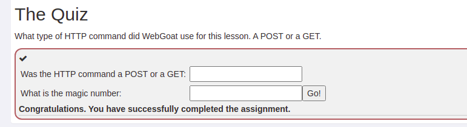
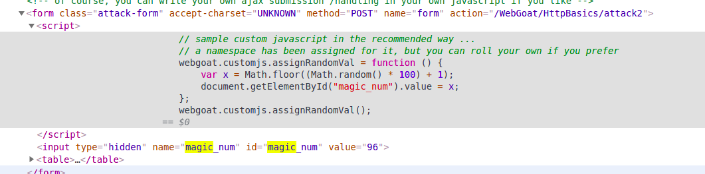
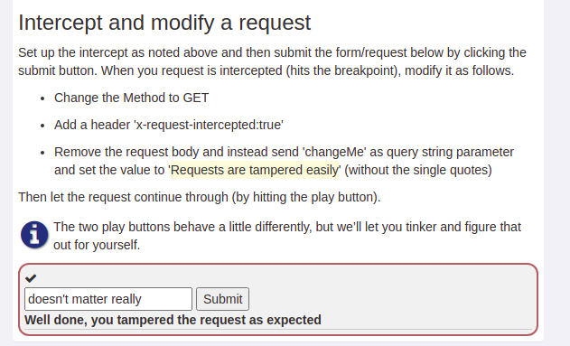
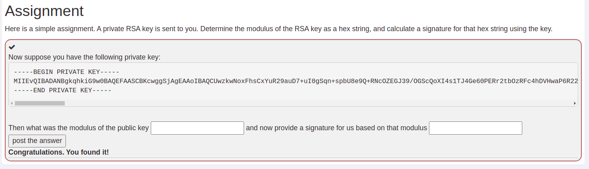

<!--
 * @Author: kok-s0s
 * @Date: 2021-04-27 09:57:22
 * @LastEditTime: 2021-04-28 02:44:44
 * @Description: record
-->

# WEBGOAT

## General

### HTTP Basics

HTTP是如何工作的？

所有的HTTP报文都遵循相同的形式。
每个客户端请求和服务器响应都包含三个部分：
- the request or response line
- a header section
- entity body

The client initiates a transaction as follows:

- The client contacts the server and sends a document request. A GET request can have url parameters and those parameters will be available in the web access logs.

    - GET /index.html?param=value HTTP/1.0

- Next, the client sends optional header information to inform the server of its configuration and the document formats it will accept.

    - User-Agent: Mozilla/4.06 Accept: image/gif,image/jpeg, /

- In a POST request, the user supplied data will follow the optional headers and is not part of the contained within the POST URL.

**Question**



之前提交信息的方式是`POST`。

按`F12`，`Ctrl + F`搜索`magic`可以得到那个数大小值。



这里是有个函数，在我`POST`过信息后，服务器的返回报文里会产生一个`magic_num`值，这个值随机生成。

### HTTP Proxies

什么是一个 HTTP Proxy？

安装ZAP，PASS
我有Burp！

练习拦截报文并对报文进行修改




### Developer Tools

`F12` and `Ctrl + Shift + I` 打开该界面

`Ctrl + L` 清除控制台信息

### CIA Triad

- The CIA Triad (confidentiality, integrity, availability) is a model for information security. The three elements of the triad are considered the most crucial information security components and should be guaranteed in any secure system.
- If only one of those three elements can be breached it can have serious consequences for the parties concerned.

- The CIA Triad was created to provide a baseline standard for evaluating and implementing security regardless of the underlying system or/and organization.


### Crypto Basics

Tips:
- (HTML encoding) HTML encoding is used a lot when sending form data and request parameters to the server. Since spaces are not allowed in a URL, this is then replaced by %20.
- (UUEncode) The Unix-2-Unix encoding has been used to send email attachments.
- (XOR encoding) Sometimes encoding is used as a first and simple obfuscation technique for storing passwords. IBM WebSphere Application Server e.g. uses a specific implementation of XOR encoding to store passwords in configuration files. IBM recommends to protect access to these files and to replace the default XOR encoding by your own custom encryption. However when these recommendations are not followed, these defaults can become a vulnerability.

**XOR encoding**

[XOR在线解码网站](https://strelitzia.net/wasXORdecoder/wasXORdecoder.html)

**Hash解码**

[MD5在线解码网站](https://md5.gromweb.com/?md5=5f4dcc3b5aa765d61d8327deb882cf99)

[SHA-256在线解码网站](https://md5calc.com/hash/sha256/passw0rd)


**Symmetric encryption** 

对称加密

AES

3DES

**Asymmetric encryption**

非对称加密

DSA

RSA

**HTTPS uses both symmetric and asymmetric keys**
Here is a short description of what happens if you open your browser and go to an https site.

- Your browser connects to the server and gets the webserver certificate

- Your browser checks if it trusts the certificate issuer by checking if the issuer certificate is in its trust store. This trust store is managed by operating system and browser updates. And on some corporate networks it is managed by the company. From the certificate the browser obtains the public key.

- The browser now generates random bytes to be used to generate a symmetric key and encrypts this with the public key of the server. So only the server can decrypt it.

- At the end of this process both the browser and the webserver will use the exchanged symmetric key (in the asymmetric key exchange process) to encrypt and decrypt messages that are sent back and forth between the browser and the webserver.

Symmetric keys are used because they can be used more safely for large amounts of data.


### Signature


**RAW signatures**
A raw signature is usually calculated as follows:

- create a hash of the data (e.g. SHA-256 hash)

- encrypt the hash using an asymmetric private key (e.g. RSA 2048 bit key)

- (optionally) encode the binary encrypted hash using base64 encoding

B will have to get the certificate with the public key as well. This might have been exchanged before. So at least 3 files are involved: the data, the signature and the certificate.

**CMS signatures**
A CMS signature is a standardized way to send data + signature + certificate with the public key all in one file from A to B. As long as the certificate is valid and not revoked, B can use the supplied public key to verify the signature.

**SOAP signatures**
A SOAP signature also contains data and the signature and optionally the certificate. All in one XML payload. There are special steps involved in calculating the hash of the data. This has to do with the fact that the SOAP XML sent from system to system might introduce extra elements or timestamps. Also, SOAP Signing offers the possibility to sign different parts of the message by different parties.

**Email signatures**
Sending emails is not very difficult. You have to fill in some data and send it to a server that forwards it, and eventually it will end up at its destination. However, it is possible to send emails with a FROM field that is not your own email address. In order to guarantee to your receiver that you really sent this email, you can sign your email. A trusted third party will check your identity and issue an email signing certificate. You install the private key in your email application and configure it to sign emails that you send out. The certificate is issued on a specific email address and all others that receive this email will see an indication that the sender is verified, because their tools will verify the signature using the public certificate that was issued by the trusted third party.

**PDF or Word or other signatures**
Adobe PDF documents and Microsoft Word documents are also examples of things that support signing. The signature is also inside the same document as the data so there is some description on what is part of the data and what is part of the metadata. Governments usually send official documents with a PDF that contains a certificate.


**task**


[How to find modulus from a RSA public key?
](https://crypto.stackexchange.com/questions/18031/how-to-find-modulus-from-a-rsa-public-key)

利用OpenSSL工具将其私钥信息到处公钥，之后利用公钥导出模数`modulus`，再利用其私钥对该数做签名操作生成`signature.sha256`，再将该文件转换为`base64`格式文件。

具体操作
```bash
openssl rsa -in rsa_priv.pem -out rsa_pub.pem -pubout

openssl rsa -in rsa_pub.pem -pubin -modulus -noout > ans01.txt

echo -n "94C33930368C4586C0B162E476F5AB83EFEB88D204AA9FEB296D4F1EF50F9135C399106277F7F38649C4285C8E2CD5327819EEB43C446BDAD6CECD115CE210D51F068FE91DB6F4C6A1F9FCF23475AAEEBCFD6FC216B703ABFBD478ACB35C1A260330B6D1AD7460356EF12B70C3ADE4CBACB87D7B031B8F3594D8E40ED86157E1ABE169E1A9825233C70D4E8E36111C1B402FAECF495D5651A67674BBB644F56256C11DD299A4429427DA0D4573B6B94CA998A6464BEEA84F1F25B5ABBE771A5D08BFCCD18EA75D763519A847CF75FD9DC5D529D96A7B36317B372C87575BE0F7516A4D27DCAE49A9114305A089EBB6E1C291109DDA0DA3D51BC516F6EE7062AD" | openssl dgst -sign rsa_priv.pem -sha256 -out sign.sha256

openssl enc -base64 -in sign.sha256 -out ans02.txt
```

**KeyStore 密钥库 证书**

自行Google

**在docker镜像中留有密码是不安全的**


- 先获取镜像`docker run -d webgoat/assignments:findthesecret`，执行`sudo docker ps`查看容器名称，用`sudo docker exec -ti 65af98e26ff8 /bin/bash`运行该容器，然后先退出该容器，将该镜像中的`/etc/shadow`文件先`cp`到自己主机上，指令为`sudo docker container cp 65af98e26ff8:/etc/shadow ./shadow`。
- 根据Linux系统密码存储的规则`$id$salt$encrypted`编写`python脚本`生成属于自己的密码。
```python
import crypt
import random

passwd = input("Please input your password: ")
salt = "$6$" + "".join(
    random.sample(
        '1234567890qwertyuiopasdfghjklzxcvbnmQWERTYUIOPASDFGHJKLZXCVBNM', 16))
print(crypt.crypt(str(passwd), salt))
```

- 将生成的密码字符床替换复制过来的`shadow`文件中`root`那行的前两个`:`中间那个`*`符号;之后再将修改过后的文件传回镜像中，替换原镜像的`shadow`文件。指令为`sudo docker container cp ./shadow 65af98e26ff8:/etc/shadow`。

- 此时重新使用`docker`开启该容器`sudo docker exec -ti 65af98e26ff8 /bin/bash`，执行`su`，输入自己设定的密码进入`root`模式，执行`cd ～`进入用户主目录，`ls`能看到目标文件`default_secret`。

- 在按照题目要求执行`echo "U2FsdGVkX199jgh5oANElFdtCxIEvdEvciLi+v+5loE+VCuy6Ii0b+5byb5DXp32RPmT02Ek1pf55ctQN+DHbwCPiVRfFQamDmbHBUpD7as=" | openssl enc -aes-256-cbc -d -a -kfile default_secret `;此时会显示如下结果：**Leaving passwords in docker images is not so secure**。

**总结**：外部的用户可以通过使用`docker`指令操作相应的容器，此时外部用户相当与该容器的`root`用户，外部用户可能会接触到些敏感信息。


**Post quantum cryptography 后量子密码学**

Google 

[Post-quantum on Wikipedia](https://en.wikipedia.org/wiki/Post-quantum_cryptography)

### Writing new lesson

PASS!