<!--
 * @Author: kok-s0s
 * @Date: 2021-04-28 09:17:19
 * @LastEditTime: 2021-05-12 10:16:06
 * @Description: record
-->

# Injection

## SQL Injection (intro)

**查询**


**Data Manipulation Language (DML)  数据操作语言**

If an attacker uses SQL injection of the DML type to manipulate your database, he will violate the following of the three protection goals in information security: confidentiality (…) & integrity (update) (Only people authorized to read the data can do so).

- DML commands are used for storing, retrieving, modifying, and deleting data.

- SELECT - retrieve data from a database

- INSERT - insert data into a table

- UPDATE - updates existing data within a table

- DELETE - Delete all records from a database table

- Example:

  - Retrieve data:

  - SELECT phone
    FROM employees
    WHERE userid = 96134;

  - This statement delivers the phone number of the employee with the userid 96134.

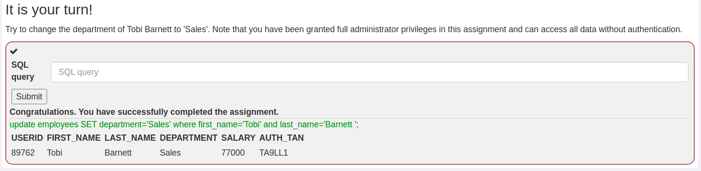

**Data Definition Language (DDL)  数据定义语言**

Data definition language includes commands for defining data structures, especially database schemas which tell how the data should reside in the database.

If an attacker uses SQL injection of the DDL type to manipulate your database, he will violate the following of the three protection goals in information security: integrity (alter) & availability (drop). (Only people authorized to change/delete the data can do so.)

- DDL commands are used for creating, modifying, and dropping the structure of database objects.

- CREATE - to create a database and its objects like (table, views, …)

- ALTER - alters the structure of the existing database

- DROP - delete objects from the database

- Example:

  - CREATE TABLE employees(
        userid varchar(6) not null primary key,
        first_name varchar(20),
        last_name varchar(20),
        department varchar(20),
        salary varchar(10),
        auth_tan varchar(6)
    );

  - This statement creates the employees example table given on page 2.

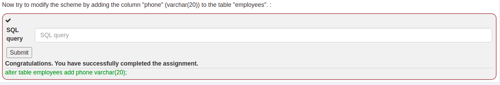

**Data Control Language (DCL)  数据控制语言**
Data control language is used to create privileges to allow users to access and manipulate the database.

If an attacker uses SQL injection of the DCL type to manipulate your database, he will violate the following of the three protection goals in information security: confidentiality (grant) & availability (revoke) (Unwanted people could grand themselves admin privileges or revoke the admin rights from an administrator)

- DCL commands are used for providing security to database objects.

- GRANT - allow users access privileges to the database

- REVOKE - withdraw users access privileges given by using the GRANT command

- Example:

  - GRANT CREATE TABLE
TO operator;

  - This statement gives all users of the operator-role the privilege to create new tables in the database.

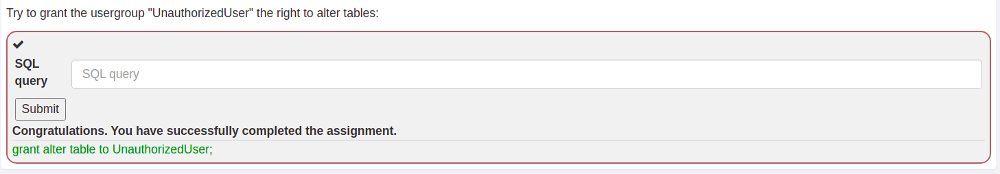


**What is SQL injection?**
SQL injections are the most common web hacking techniques. A SQL injection attack consists of insertion or "injection" of malicious code via the SQL query input from the client to the application. If not dealt with correctly, such an injection of code into the application can have an serious impact on e.g. data integrity and security.

SQL injections can occur, when unfiltered data from the client, e.g. the input of a search field, gets into the SQL interpreter of the application itself. If the input from the client does not get checked for containing SQL commands, hackers can easily manipulate the underlying SQL statement to their advantage.
Per example if the input is not filtered for SQL metacharacters like -- (comments out the rest of the line) or ; (ends a SQL query and that way can be used to chain them).

**Consequences of SQL injection**
A successful SQL injection exploit can:
- Read and modify sensitive data from the database

- Execute administration operations on the database

  - Shutdown auditing or the DBMS

  - Truncate tables and logs

  - Add users

- Recover the content of a given file present on the DBMS file system

- Issue commands to the operating system

SQL injection attacks allow attackers to
- Spoof identity

- Tamper with existing data

- Cause repudiation issues such as voiding transactions or changing balances

- Allow the complete disclosure of all data on the system

- Destroy the data or make it otherwise unavailable

- Become administrator of the database server

**Severity of SQL injection**
- The severity of SQL injection attacks is limited by
Attacker’s skill and imagination

- Defense in depth countermeasures

  - Input validation

  - Least privilege

- Database technology

Not all databases support command chaining
- Microsoft Access

- MySQL Connector/J and C

- Oracle

SQL injection is more common in PHP, Classic ASP, Cold Fusion and older languages
- Languages that do not provide parameterized query support

- Parameterized queries have been added to newer versions

- Early adopters of web technology (i.e. Old Code)

Not all databases are equal (SQL Server)
- Command shell: master.dbo.xp_cmdshell 'cmd.exe dir c:'

- Registry commands: xp_regread, xp_regdeletekey, …

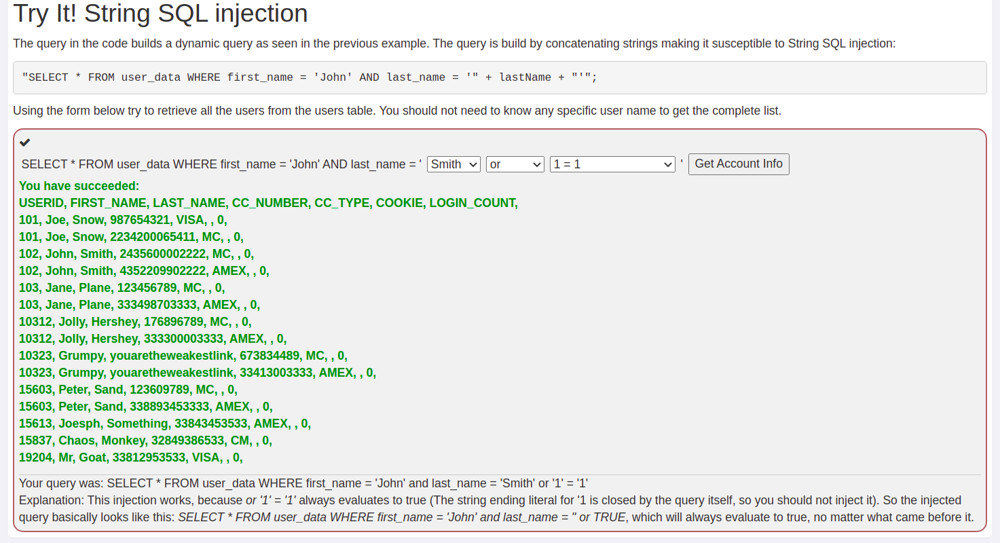

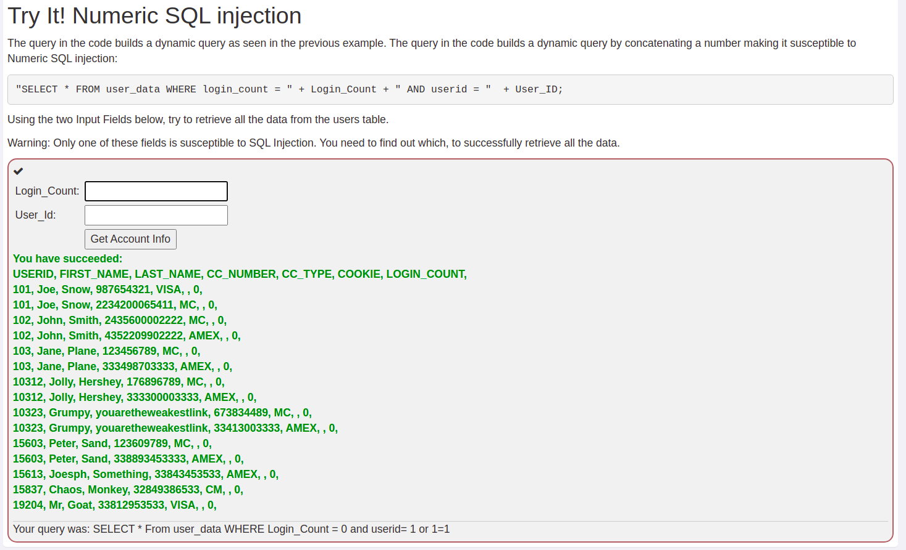

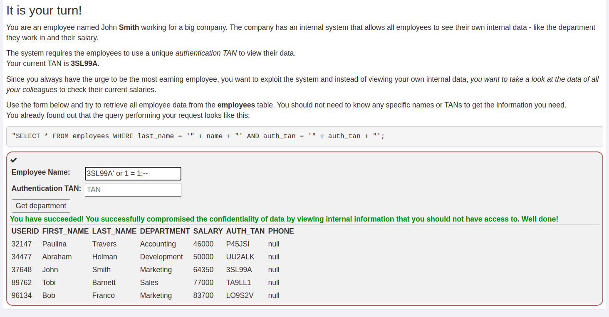

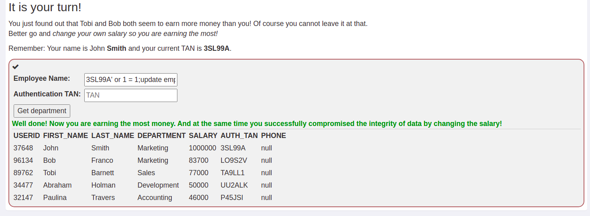

`3SL99A' or 1 = 1;update employees set salary=1000000 where first_name='John' and last_name='Smith';--`


`3SL99A' OR 1=1;DROP TABLE access_log;--`


## SQL Injection (advanced)

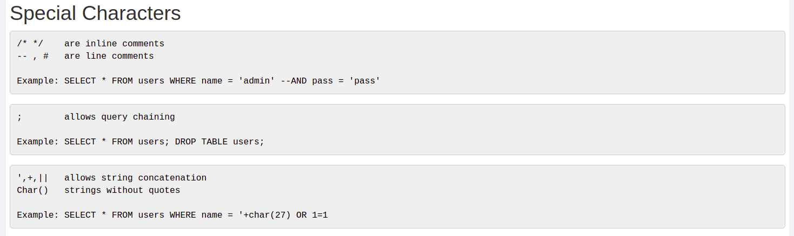

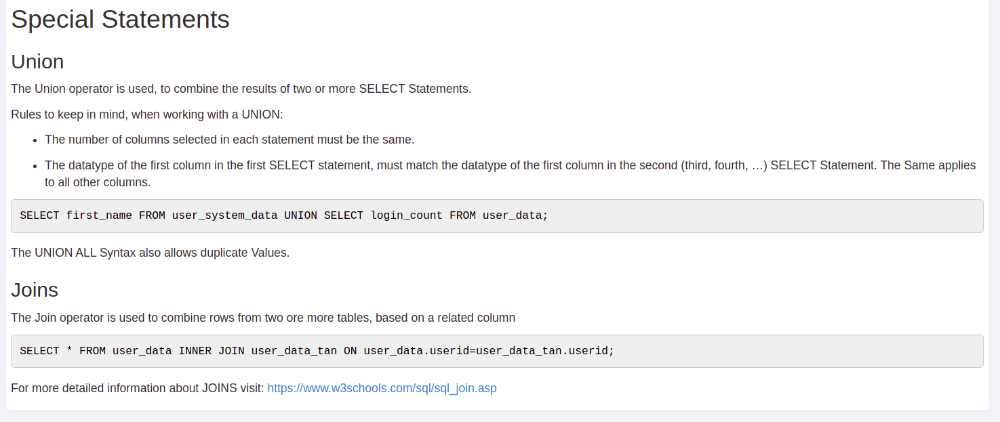

**task**

在`name`框里输入`or '1'='1' ;SELECT * FROM user_system_data --`，列出所有密码信息，从中到找`Dave`的密码。

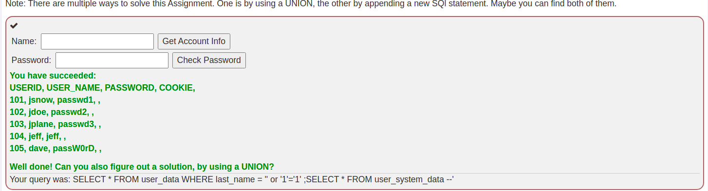

**Blind SQL injection**
Blind SQL injection is a type of SQL injection attack that asks the database true or false questions and determines the answer based on the applications response. This attack is often used when the web application is configured to show generic error messages, but has not mitigated the code that is vulnerable to SQL injection.

Difference
Let us first start with the difference between a normal SQL injection and a blind SQL injection. In a normal SQL injection the error messages from the database are displayed and gives enough information to find out how the query is working. Or in the case of an UNION based SQL injection the application does not reflect the information directly on the web page. So in the case where nothing is displayed you will need to start asking the database questions based on a true or false statement. That is why a blind SQL injection is much more difficult to exploit.

There are several different types of blind SQL injections: content-based and time-based SQL injections.


**task**

[视频解答](https://www.youtube.com/watch?v=GtsHoeIlSf8)

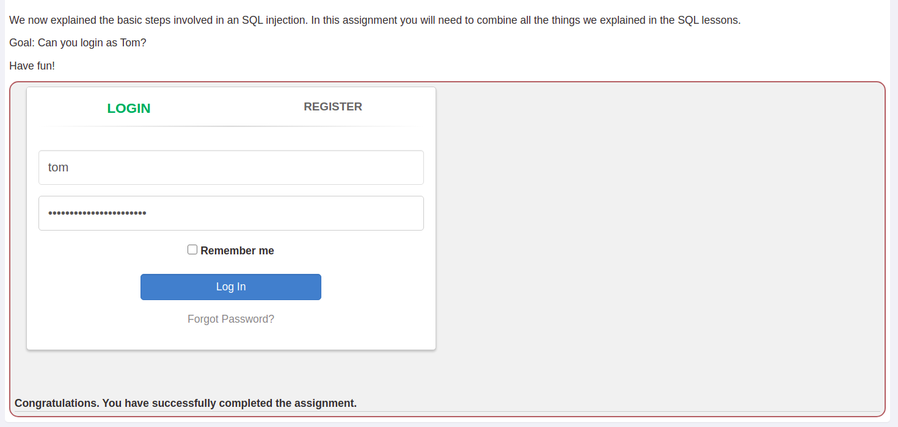


**Q&A**

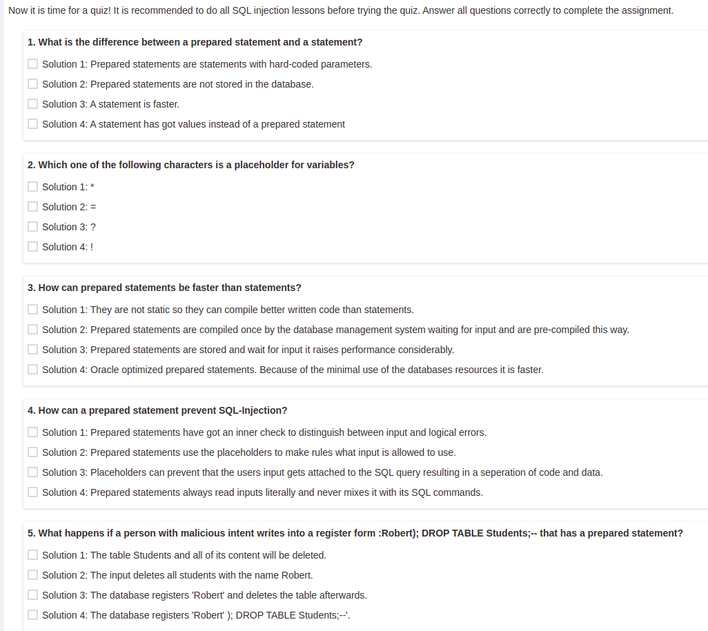

answer: D C B C D


## SQL Injection (mitigation)

[What is parameterized query?
](https://stackoverflow.com/questions/4712037/what-is-parameterized-query)

仿照03和04的part构造没有SQL注入漏洞的代码
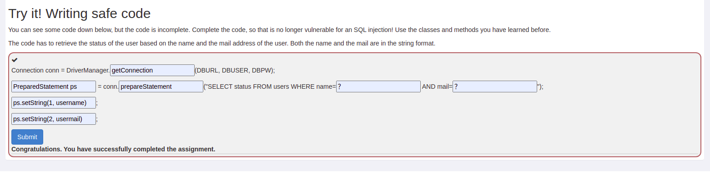


同理05,编写没有SQL注入漏洞的代码
```java
String userName = "kok-s0s";
try {
    Connection conn = DriverManager.getConnection(DBURL,DBUSER,DBPW);
    PreparedStatement ps = conn.prepareStatement("SELECT * FROM users WHERE name = ?");
    ps.setString(1, userName);
    ResultSet results = ps.executeQuery();
    System.out.println(results.next());
} catch (Exception e) {
    System.out.println("Oops. Something went wrong!");
}
```
使用try/catch编写格式，在try里连接数据库，按Parameterized Queries（参数化查询）的方式进行编写Java代码。


